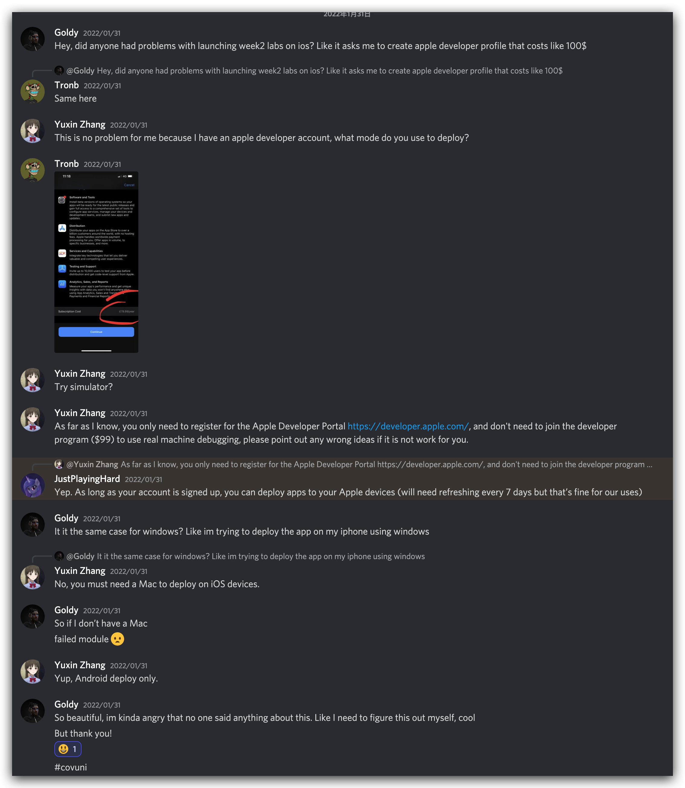

# Coffer

## Introduction

This is a mobile app that tracks users' daily coffee consumption and records caffeine levels. Adults should not consume more than 300 mg of caffeine per day. The program has built-in coffee brands and their data, and the database can be updated through the Internet or automatically.

Avaliable at Apple TestFlight.

## Architecture

Framework: Microsoft Xamarin.Forms

Development IDE: Jetbrains Rider 2021.3.3

NuGet Package Used:

- Microsoft.Extensions.DependencyInjection
- Sqlite-net-pcl
- Xamarin.Essentials
- Xamarin.Forms

## Collaboration

